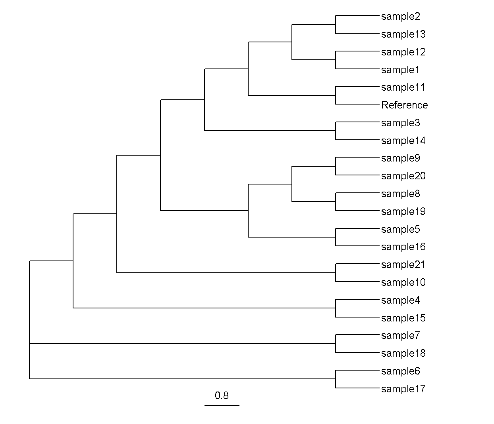

# 
# MBB 659 Term Project

### By Marcus Yee
[](https://www.nextflow.io/)
[](https://sylabs.io/docs/)


--------------------

## Overview

This pipeline creates a high-resolution phylogenetic tree using Core Genome Single Nucleotide Polymorphisms(SNPs) of bacterial strains in the same species.

--------------------

# Introduction

Phylogenetic trees are a powerful tool in illustrating the evolutionary history between organisms. Widely used in bacterial genomics, these trees can help microbiologists learn how bacteria evolve and are especially important in tracking bacterial outbreaks. Phylogenetic trees typically utilize Single Nucleotide Polymorphisms(SNPs) which are a variation in a single position in a DNA sequence. SNPs are useful as selectively neutral SNPs have been shown to accumulate at a relatively uniform rate and can be used to measure divergence between bacteria(1). Certain phylogenetic analyses examine SNPs in a specific gene such as the 16s rRNA gene but they can only distinguish bacteria at the genus or species level and lack the resolution to make a high-quality tree at the strain level, which outbreak investigations often require. In comparison, another method, MultiLocus Sequence Typing(MLST), examines SNPs in multiple housekeeping genes but relies on a known and established set of genes which can change and are not always availble for lesser known pathogens. Instead, a highly used method is examining SNPs in the core genome, the set of genes shared amongst a set of bacteria. This has been shown to more accurate and robust than the traditional phylogenetic methods that use a single gene (ex. 16S rRNA) or multiple genes (ex. MLST)(2). 

This pipeline creates and visualizes a core genome phylogenetic tree. Additionally, as recombination events often impact the ability to reconstruct true trees(3), these sites of recombination are removed. This pipeline is well suited for dealing with more unknown pathogens as it does not rely on a list of known genes, able to generate the core genome <em>de novo</em>. It can be a great tool for outbreak investigation, especially from more rare bacteria, and can quickly create a high-resolution phylogenetic tree that can trace the lineages of specific strains of interest. 


--------------------

# Workflow overview

This pipeline, mainly uses Snippy(4), a haploid variant caller and core genome aligner. First, Snippy’s default function will be used to find SNPs of each strain against the reference. Next, Snippy-core is used to summarize the SNPs in the core genome. Then, Snippy-clean_full_aln is used to clean the output of snippy-core and Gubbins(5) is used to remove any recombination sites. The Snippy function SNP-sites is then used to extract the SNP sites, fasttree(6) is used to generate a maximum-likelihood phylogenetic tree and the tree is then visualized using the R package ggtree(7). Several parts of this pipeline were built using nf-core(8).


--------------------

## Dependencies

Singularity images will be automatically downloaded for the following dependencies

```
snippy 4.6.0
fasttree 2.1.10
gubbins 3.0.0
ggtree 3.8.0
nextflow 22.04.5.5708
R 4.3.1 
```
--------------------
## Usage

#### Input
This pipeline takes as input assembled genomes in fasta format. The genomes should be bacterial strains from the same species and include a reference genome. The path to the fasta files should be added to `nextflow.config` with the strain genomes being added to `params.genome` and the reference genome being added to `params.reference` . A test dataset of _Listeria monocytogenes_(9) is currently included and is located in the `data/` and `ref/` folders. 

#### Output
This pipeline outputs a tree in the newick format, named `clean.core.tree` located in `results/Fasttree`. It also visualizes this newick tree in a pdf format, `Rplots.pdf` located in `results/Visualization_ggtree`. For visualization purposes, the tree ignores branch lengths. To customize the tree, edit the R script located in `modules/local/script.r`

### To run the pipeline:

If singularity is not currently properly loaded

```sh
#to allow the use of the 'module' command
source /cvmfs/soft.computecanada.ca/config/profile/bash.sh
#load nextflow and singularity
module load nextflow
module load apptainer

```
To clone the repository
```sh
git clone https://github.com/mayee123/PhylogenyCG.git
```

To run the pipeline, go to the project directory
```sh
cd PhylogenyCG
```
And run
```sh
nextflow run main.nf -profile singularity
```

--------------------

## Expected outputs
The expected results are located in the folder `expected_results/`

To view if the pipeline ran correctly, navigate to the `Visualization_ggtree/` folder using
```sh
cd results/Visualization_ggtree
```
The resulting file, `Rplots.pdf` should be a visualization that looks like this



--------------------

## References
(1)Shakya, M., Ahmed, S.A., Davenport, K.W. et al. Standardized phylogenetic and molecular evolutionary analysis applied to species across the microbial tree of life. Sci Rep 10, 1723 (2020) https://doi.org/10.1038/s41598-020-58356-1

(2)Tian, R., Imanian, B. VBCG: 20 validated bacterial core genes for phylogenomic analysis with high fidelity and resolution. Microbiome 11, 247 (2023) https://doi.org/10.1186/s40168-023-01705-9

(3)Stott, C.M., Bobay, LM. Impact of homologous recombination on core genome phylogenies. BMC Genomics 21, 829 (2020) https://doi.org/10.1186/s12864-020-07262-x

(4)Seemann, T. Snippy. GitHub repository.(2020) https://github.com/tseemann/snippy 

(5)Nicholas J. Croucher, Andrew J. Page. et al. Rapid phylogenetic analysis of large samples of recombinant bacterial whole genome sequences using Gubbins, Nucleic Acids Research 43, 3 (2015)

(6)Price MN, Dehal PS, Arkin AP. FastTree 2 – Approximately Maximum-Likelihood Trees for Large Alignments. PLOS ONE 5, 3 (2010)

(7) YuLab, SMU. ggtree. GitHub repository.(2019) https://github.com/YuLab-SMU/ggtree 

(8) Ewels, P.A., Peltzer, A., Fillinger, S. et al. The nf-core framework for community-curated bioinformatics pipelines. Nat Biotechnol 38, 276–278 (2020)

(9)Burall, L. S., Grim, C. J. et al. A clade of Listeria monocytogenes serotype 4b variant strains linked to recent listeriosis outbreaks associated with produce from a defined geographic region in the US. PloS one 12, 5 (2017)